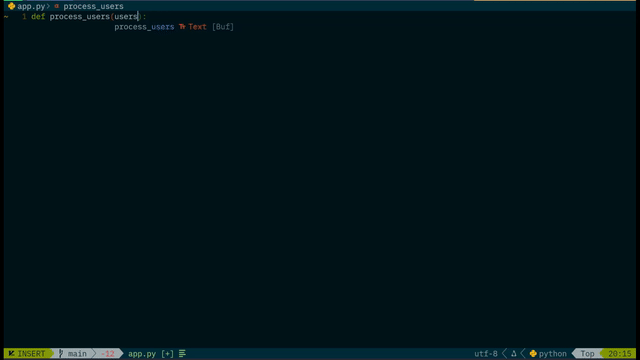

# python-type-hints.nvim
A Neovim plugin that provides context-aware Python type completions

> Suggests relevant type annotations based on **parameter names**, **function names**, and **context** — no LSP required.

## Why This Plugin?

Most AI-powered auto-completion tools suggest generic or incorrect types. But your linter (e.g. Ruff, mypy, pyright) expects realistic, meaningful types

## What This Plugin Does?

Example:

When you type:

```python
def process_users(users_data:
```

→ It suggests:

```
list[dict[str, Any]]
UsersPayload
pd.DataFrame
Optional[list[User]]
```

When you type:

def get_user(user_id: int) -> 

→ It suggests:

```
Optional[User]
dict[str, Any]
User
```

All automatically, based on naming patterns and context.

**Features**

✅ Smart type suggestions based on variable/function names

✅ Parameter vs return type context detection

✅ Works offline — no LSP or AI needed

✅ LuaSnip integration for manual expansion (e.g. ldda<Tab>)

✅ Rich documentation in completion menu (with code examples)

✅ Tree-sitter + regex parsing for accurate context detection

✅ Configurable and lightweight

## Installation
Using Lazy.nvim (recommended)

```lua
{
  "dumidusw/python-type-hints.nvim",
  ft = "python",
  opts = {
    enable_snippets = true,  -- Load LuaSnip snippets (default: true)
    enable_logger = false,   -- Enable debug logs (default: false)
  },
  dependencies = {
    "hrsh7th/nvim-cmp",
    "L3MON4D3/LuaSnip",
    "nvim-treesitter/nvim-treesitter", -- for context parsing
  },
}
```

✅ Make sure you have python parser installed:

```
:TSInstall python
```

## Usage Examples


| You Type | Suggested Types |
|----------|-----------------|
| `users_` | `list[dict[str, Any]]`, `pd.DataFrame`, `UsersPayload` |
| `user_id:` | `int`, `str`, `Optional[int]` |
| `config:` | `dict[str, Any]`, `Config`, `Settings` |
| `->` after `get_user()` | `Optional[User]`, `dict[str, Any]` |

## Snippets (Optional)

Trigger these in a type context with `<Tab>`:

| Trigger | Expands To |
|--------|------------|
| `ldda` | `list[dict[str, Any]]` |
| `dsa`  | `dict[str, Any]` |
| `tldai` | `tuple[list[dict[str, Any]], int]` |
| `opt`  | `Optional[T]` |
| `ls`   | `list[str]` |
| `li`   | `list[int]` |
| `any`  | `Any` |
| `none` | `None` |
| `union` | `Union[T, U]` |
| `callable` | `Callable[[...], ...]` |

> Snippets are auto-loaded if enable_snippets = true.


## Configuration

All options (with defaults):

```lua
require("python_type_hints").setup({
  enable_snippets = true,  -- Load built-in LuaSnip snippets
  enable_logger = false,   -- Print debug logs to :messages
})
```

Or use opts in Lazy.nvim as shown above.

## Debugging

Enable logging to troubleshoot:

```lua
opts = {
  enable_logger = true,
}
```

Then check logs with:

```
:messages
```

Look for [py-hints] entries.

## Contributing
PRs welcome! You can:

- Add more type patterns

- Improve context detection

- Add support for custom user rules

- Suggest new snippets

## Demo


## Acknowledgements
Inspired by real-world Python development workflows.

Thanks to the Neovim community for support and feedback.


## 🌟 Star It If You Like It!
If this plugin saves you time, please kindly consider giving this a ⭐ because your action helps more people discover this plugin!
